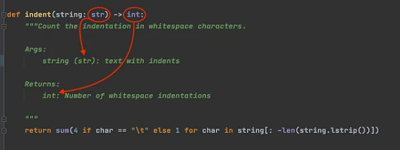
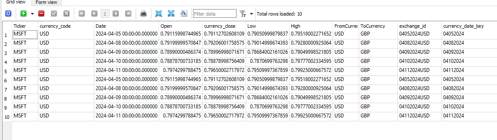

# vera_project

## Github repo
https://github.com/hgao62/vera_project.git
### Task 1
* 1. create main.py, extract_data.py, load_data.py
* 2. create requirments.txt file that has contents below
```
SQLAlchemy==1.4.52
yfinance==0.2.37
pandas>=1.3.0
```
* 3. run pip install -r requirements.txt
* 4. create two functions in extrac_data.py see below

```python
def get_stock_history(stock):
    '''this function should pull stock history given a stock input,
       please follow this link to get example on how to use yahoo finance api
       https://github.com/ranaroussi/yfinance
    '''


```
it should return a data frame like this below

<!--  -->


```python
def get_stock_financials(stock):
    '''this function should get share holders of a stock given a stock input,
       please follow this link to get example on how to use yahoo finance api
       https://github.com/ranaroussi/yfinance
    '''

```
it should return a data frame like this below


When creating functions, please add type hinting and doc string like below




### Task 2
```python
1. add function below to extract_data.py
def get_exchange_rate(stock, period, interval, to_currency):
    # 1 get currency code of the stock
    ticker = yf.Ticker(stock)
    currency_code = ticker.fast_info["currency"]
    fx_rate_ticker = f'{currency_code}{to_currency}=X'
    fx_rates = yf.download(fx_rate_ticker,period=period, interval=interval)


get_exchange_rate("AAPL", period="5d", interval="1d", "GBP")

```
and output should look like below



```python
2. add function below to extract_data.py
def get_news(stock):
```
and output should look like below


### Task 3
1. creat function as below
```python
def enrich_stock_history(stock_history:pd.DataFrame):
    """
    This function adds two columns to stock_history data frame
        a. "daily_return": this is caluclated using the "close" price column, google "how to calcualte daily return pandas"
        b. "cummulative_return": this is caculated using the "daily_return" caculated from step above(see stackoverflow below)
        https://stackoverflow.com/questions/35365545/calculating-cumulative-returns-with-pandas-dataframe
    """
    return stock_history

```
2. create load_data.py file and create function inside like below that save dataframe to sqlite db
     
```python
 def save_df_to_db(
    df, table_name, if_exists="append", dtype=None, engine=MYSQL_ENGINE 
) -> None:
    """
    Function to send a dataframe to SQL database.

    Args:
        df: DataFrame to be sent to the SQL database.
        table_name: Name of the table in the SQL database.
        if_exists: Action to take if the table already exists in the SQL database.
                   Options: "fail", "replace", "append" (default: "append").
        dtype: Dictionary of column names and data types to be used when creating the table (default: None).
        engine(default to MYSQL_ENGINE): db engine type, in our project, this could be sqlite or mysql

    Returns:
        None. This function logs a note in the log file to confirm that data has been sent to the SQL database.
    """
```

instructions on how to connect to sqlite using python

```python

import sqlite3 #1. import sqlite library(used to interact with sqlite)
from sqlalchemy import create_engine #2. import sqlalchemy library(used for interact with db using pandas)
ENGINE = create_engine(f"sqlite:///<path on your local drive>.db") #3. create engine
df.to_sql() #4. final step of saving dataframe to db, see pandas documents on how to pass the requried parameterss
# https://pandas.pydata.org/docs/reference/api/pandas.DataFrame.to_sql.html
```


## How to set up airflow
#### 1. build image and create a container based on the image just  created
```docker
  docker-compose up --build
````


### Useful docker  commands
1. list all local images
```docker
docker image ls

````


### Useful Airflow  commands
1. start airflow scheduler
```
airflow scheduler

````
2. list all dags
```
airflow dags list
```

3. check current executor type
```
airflow config get-value core executor
```

### how to run mysql commands within docker container

```
mysql -u root -p

```

delete all local docker images, run command line below in powershell
https://stackoverflow.com/questions/44785585/how-can-i-delete-all-local-docker-images
```
docker images -a -q | % { docker image rm $_ -f }
```