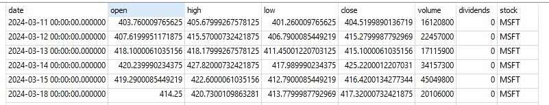
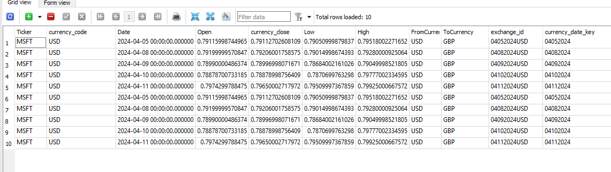

# vera_project

## Github repo
https://github.com/hgao62/vera_project.git
### Task 1
* 1. create main.py, extract_data.py, load_data.py
* 2. create requirments.txt file that has contents below
```
SQLAlchemy==1.4.52
yfinance==0.2.37
pandas>=1.3.0
```
* 3. run pip install -r requirements.txt
* 4. create two functions in extrac_data.py see below

```python
def get_stock_history(stock):
    '''this function should pull stock history given a stock input,
       please follow this link to get example on how to use yahoo finance api
       https://github.com/ranaroussi/yfinance
    '''


```
it should return a data frame like this below

<!--  -->


```python
def get_stock_financials(stock):
    '''this function should get share holders of a stock given a stock input,
       please follow this link to get example on how to use yahoo finance api
       https://github.com/ranaroussi/yfinance
    '''

```
it should return a data frame like this below


When creating functions, please add type hinting and doc string like below


### Task 2
```python
1. add function below to extract_data.py
def get_exchange_rate(stock):
```
and output should look like below



```python
2. add function below to extract_data.py
def get_news(stock):
```
and output should look like below

